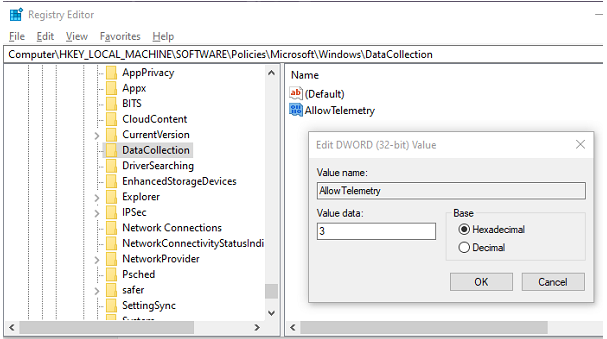
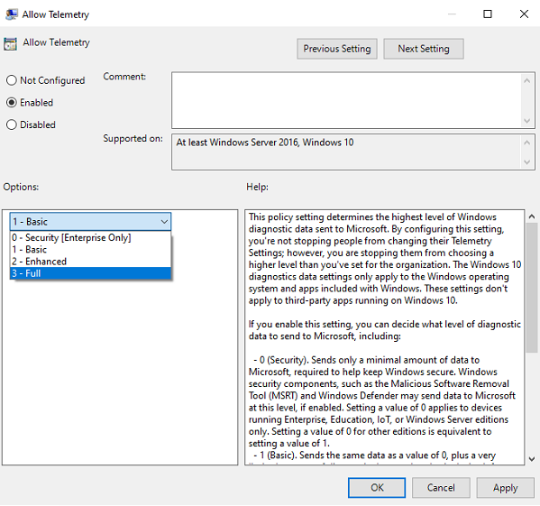
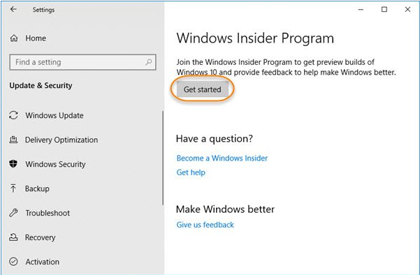
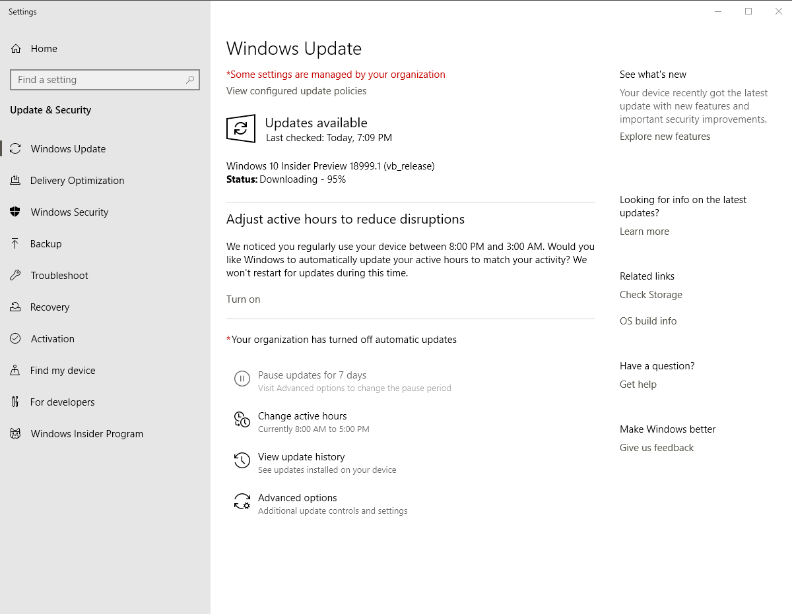

# Activating Windows Linux Subsystem 2 (WSL2)
## Sign up for Windows Insider program
- Go to [Register for Windows Insider](https://insider.windows.com/en-us/getting-started/)
- Sign up for Windows Insider program

## Activate Windows Insider Builds
1. Enable Full Diagnostic Data
    - go to Settings --> Privacy --> Diagnostics & feedback --> Diagnostic data
    - Choose __Full__ as the option
2. Enable Telemetry Data via Registry
    - Open Registry Editor
        + Press Windows Key + R then type `regedit` to open registry editor
    - Navigate to:

    ```console
    HKEY_LOCAL_MACHINE\Software\Policies\Microsoft\Windows\DataCollection
    ```

    - Right-click __DataCollection__, click __New__ and then click __DWORD (32-bit) Value__
    - Name it as  __AllowTelemetry__, and then press __ENTER__
    - Double-click __AllowTelemetry__, set the value as 3, and then click __OK__.

    <p align="center">
      
    </p>

    - Repeat the above steps for:

    ```console
    HKEY_CURRENT_USER\Software\Policies\Microsoft\Windows\DataCollection
    ```

    - Restart your computer

3. Group Policy to enable Telemetry
    - Press __Windows key + r__ and type __gpedit.msc__ in the Run prompt, hit __ENTER__ to launch group policy editor
    - Go to __Computer Configuration__ --> __Administrative Templates__ --> __Windows Components__ --> __Data Collection and Preview Builds__
    - Double-click __Allow Telemetry__
    - In the __Options__ box, configure the level as 3, and then click __OK__

    <p align="center">
      
    </p>

## Activate Insider Build
1. Search for __Check for Updates__ in the Windows search menu
2. In the new window select __Windows Insider Program__ at the bottom of the menu
3. Select Get Started and follow the instructions, making sure you select __Fast__ when asked

    <p align="center">
      
    </p>
    
4. Once you have completed the registration you will need to check for updates and let Windows install the new insider build.

    <p align="center">
      
    </p>

5. Once done you should restart your computer

## Turn on linux subsystem feature
1. Open Windows PowerShell as administrator and run the commands:

    ```console
    Enable-WindowsOptionalFeature -Online -FeatureName VirtualMachinePlatform
    Enable-WindowsOptionalFeature -Online -FeatureName Microsoft-Windows-Subsystem-Linux
    ```

2. You will need to restart your computer again

## Download the linux distro
1. Open the Microsoft Store and choose your favorite Linux distribution by searching for them (I prefer Ubuntu):
    * [Ubuntu](https://www.microsoft.com/en-ca/p/ubuntu/9nblggh4msv6?rtc=1&activetab=pivot:overviewtab)
    * [Debian](https://www.microsoft.com/en-ca/p/debian/9msvkqc78pk6?rtc=1&activetab=pivot:overviewtab)

2. From the distro's page, select __Get__
3. Once done installing, open up __Powershell__ as administrator and run (replace distro with the name of the distro you installed):

    ```console
    wsl --set-version [Distro] 2
    ```

    ```console
    wsl --set-default-version 2
    ```

## Finalizing
1. To complete the initialization of your newly installed distro, launch a new instance by searching in the Start menu and launching the distro

2. The first time a newly installed distro runs, a Console window will open, and you'll be asked to wait for a minute or two for the installation to complete

3. Once installation is complete, you will be prompted to create a new user account (and its password)

4. Most distros ship with an empty/minimal package catalog. You should regularly be updating your package catalog, and upgrading your installed packages using your distro's preferred package manager

      ```console
      sudo apt-get update && sudo apt-get upgrade
      ```

